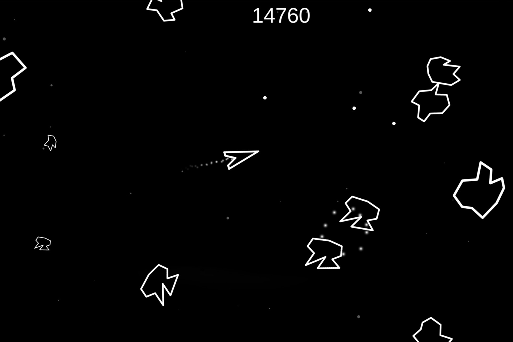

<div class="text-center p-4">
  
</div>

# Would you like to play?
You could crash into BIG astroids or be defeated by a small astroid. And watch out! Even the large astroids can fly across the screen at high speeds! But don't worry. We have equipted your ship with unlimited projectiles to defeat these astroids. But some may take many hits to destroy, so beware... and good luck!
- a group of four coders...

## A group of four coders
Astroids, a C++ remake of the classic astroids game, was created by three of my classmates and me: Andrew Balaschak, Garett Pascual-Folster, Svetlo, and Seri Nakamura. A. Balaschak and Svelto worked on the output, the visible game side of the coding while G. Pascual-Folster and I worked on the moving parts of the game. I worked mostly on the player 'sprite' and G. Pascual-Folster worked on the astroids 'sprites'. We were in charge of our own sections, but by the end of the project, we had learned to work together in order to make sure our own parts of the code correlated with each other and would work as we wanted it to.

# A simple example class and a function from the project that I implemented.
```cpp
class Player : public MovingObject {
protected:
// etc. variables
	struct Scalar { //dictates what proportion of the player's acceleration goes into x and y components of velocity
		double x; //proportion of acceleration in x direction (-1 to 1)
		double y; //proportion of acceleration in y direaction (-1 to 1)
	};
	Scalar s;
	sf::Sprite* playerSprite;
	sf::Texture* playerTexture;

// etc. functions

	//accelerates forward by moveSpeed, limit is maxVelocity
	void accelerateForward() {
		if (fuel > 0) {
			//FOR X
			//velocity adjustment will not be applied if velocity is over max
			if (abs(v.x) < maxVelocity) {
				v.x += moveSpeed * s.x;
			}
			//unless the adjustment decreases the velocity
			else if (abs(v.x + (moveSpeed * s.x)) < maxVelocity) {
				v.x += moveSpeed * s.x;
			}
			//FOR Y
			//velocity adjustment will not be applied if velocity is over max
			if (abs(v.y) < maxVelocity) {
				v.y += moveSpeed * s.y;
			}
			//unless the adjustment decreases the velocity
			else if (abs(v.y + (moveSpeed * s.y)) < maxVelocity) {
				v.y += moveSpeed * s.y;
			}
			fuel -= fuelConsumptionRate;
		}
	}
};

```

## Outcome
As the first group coding project I had participated in, we learned together that planning isn't the only thing important in group projects like this one. We needed to be working with each other to make sure each of our parts of the code would work together. I learned the importance of commenting in this project. When we first came together with our parts of the code and tried to figure out how to incorperate each other's code, we were often confused by even the smallest things, like variable names. 
