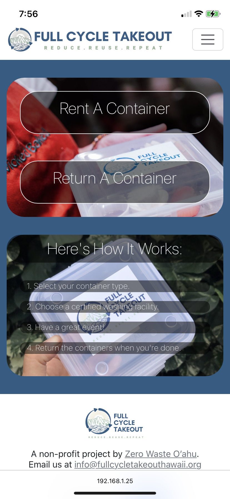

Our goal throughout this project was to design an app for the reusable takeout container program, Full Cycle Takeout, so that it was easier to use through mobile.
We needed a user interface that allows for 'Check Out' of containers and 'Return' of containers because Full Cycle Takeout wanted to be able to track which containers are in use.

## Full Cycle Application
<a href="https://github.com/ethical-haccers">Ethical HACCers GitHub Organization Page</a>

  

## The Back-End Team
My group divided ourselves into three groups, Front-end, Back-end, and Schema. I worked on the Back-end team, dealing with the admin user page, the order return pages, and deployment of the website. 

My first task was to create the Accounts page for Admins (the Full Cycle Takeout Admins) to view all accounts made in utilizing the web application. This page displayed information from the Meteor Account collection created for each 'User'.
And although it wasn't my task, I also took on editing the User Account collection and learned how to manipulate the schema in order to display information about the Account itself in the Account Information page on the Admin access.

The second task I completed was the page for order/container return. This page took in the container ID to return and once the ID was submitted, the back-end handled reassigning certain values to the container collection: assigning the current date as the return date and reassigning the status of the container as 'cleaning' (meaning it is returned to the Full Cycle Workers). This task was pretty rewarding because I felt that I understood the connections between the collection, schema, and front-end and how to utilize them together, rather than blindly copying the initial form template.

And lastly, I worked on deployment through Digital Ocean. I found Digital Ocean to be very convenient in deploying our application and potentially useful in future projects. Setting up and Deploying the application does take some time, however the usage of two (cute) mup commands for Meteor Up setup and deploy was simple and convenient.

### Learning Experience
Throughout this experience, I learned more about the Meteor utilities and libraries. I struggled the most with the Meteor Accounts and learning how to utilize this collection. Since it is a Meteor collection, it was a little difficult to create new variables to store data in the account. One of the first issue that prevented further development was subscribing to the Account collection. Although it is a Meteor collection, it is still necessary to subscribe to the Meteor Account collection itself. 

This experience also allowed me to practice managing a team of developers and making sure to be constructive and assertive when suggesting ideas and also making other accountable for their part in a project. I learned that there are situations where one must take a step back and allow other developers to do their designated part and other times, although not ideal, I must take on others' tasks because they are necessary to move forward with the project.
As seen by the results of the final project, I am still learning how to manage people and make sure the outcomes we want get accomplished. 
