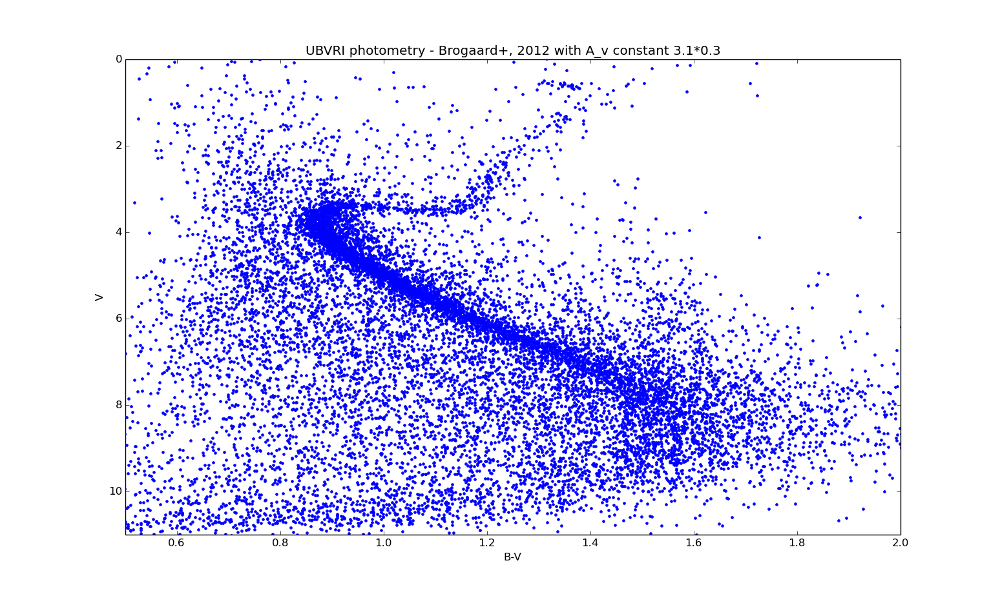

  

# Predict the Sky
Initially, this project was a reseach study of white-dwarf chronometry in NGC 6791 and whether some giants fail before Helium flash. The project utilized MESA One-Dimentional Stellar Evolution Simulator code to explore different reasons for the high Z value of the star cluster, however, we slowly discovered that the capabilities of MESA were not suited for this project and the professor and I decided to change the study to a reasearch on BVI isochrone fitting of NGC 6791 to find age of the star cluster. The theory was if we could fit isochrones of certain properties to NGC 6791, we would be able to better understand the star cluster and maybe realize a more accurate age of the star cluster.
NGC 6791 is a peculiar star cluster as it has a high Z value, a measurement of metal content, yet it is an extremely old star cluster, nearly 8 billion years old. A star cluster of this age should be metal-poor, low Z value, however while being one of the oldest, it is also the most metal-rich cluster in the Milky Way. 
This project was cut short due to Covid-19, so it is an uncompleted work. 

## A Great Mentor
I worked under a professor in the Physics and Astronomy department at Washington State University, Guy Worthey. This research was a guided study, as Professor G. Worthey would give me work to complete and he would explain the significance of the findings from the work I did.

# The Outcome
I learned a lot about research in this project, being my first research project. But the majority of learning came from the Astronomy side of the project. Although it was an incomplete project, I was able to further understand star clusters as a whole, but also learned a lot about the star cluster NGC 6791.
